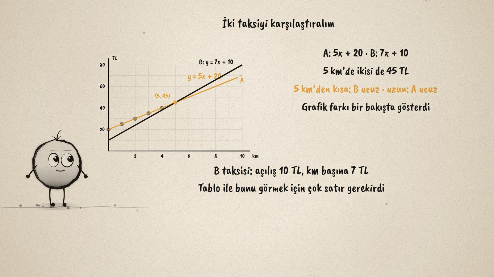
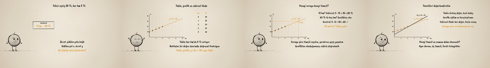

# Taksi Ücreti · Linear Functions and Their Representations

**▶ Tarayıcıda izleyin / Watch in the browser:** https://hakanatas.github.io/taksi-ucreti/ 
**⬇ MP4 + altyazılar / MP4 + subtitles:** [Releases](https://github.com/hakanatas/taksi-ucreti/releases) 
**✎ Kullanılan istem / The prompt behind it:** [PROMPT.md](PROMPT.md) 
**🎞 Bütün filmler / All films:** [Nokta'nın Filmleri](https://hakanatas.github.io/nokta-filmleri/?sinif=8)

> **TR —** 8. sınıf matematik "Cebirsel Düşünme ve Değişimler" temasındaki MAT.8.2.2 öğrenme çıktısı için hazırlanmış, tamamen JavaScript ile çizilen 92 saniyelik mürekkep animasyonu. Bir taksinin açılışı 20 TL, her kilometresi 5 TL. Aynı doğrusal ilişki üç temsille gösteriliyor: tablo (20, 25, 30, 35, 40), grafikte bir doğru üzerindeki noktalar ve y = 5x + 20. Sorulara göre uygun temsil seçiliyor ve gerektiğinde temsiller arasında geçiliyor: 12 km için cebirsel ifade (80 TL), 60 TL ile kaç km için grafik (8 km, cebirle doğrulama), ilk kilometreler için tablo. İkinci bir taksi (y = 7x + 10) aynı grafikte karşılaştırılıyor: 5 km'de ikisi de 45 TL, daha kısa yolda B, uzun yolda A ucuz. Son olarak temsiller ekonomiklik ve kullanışlılık açısından değerlendiriliyor. Altyazılar Türkçe, İngilizce ya da ikisi birlikte seçilebilir.

A 92-second ink animation for **8th-grade maths**. Nokta, the ink character from [The Learning Ink](https://github.com/hakanatas/the-learning-ink), is the guide again. Both fares are drawn by one `line(m, b)` call in `scenes/scene1.js` from the same slope and intercept that appear in their equations, so the crossing at (5, 45) on screen is exactly where 5x + 20 = 7x + 10.

## Learning outcome

MEB, Türkiye Yüzyılı Maarif Modeli, Ortaokul Matematik, 8th grade, "Cebirsel Düşünme ve Değişimler" theme:

**MAT.8.2.2. Gerçek yaşam durumlarındaki doğrusal ilişkileri doğrusal fonksiyonlarla temsil edebilme**
- a) Doğrusal fonksiyonların cebirsel, tablo ve grafik temsillerini tanır.
- b) Gerçek yaşam durumlarındaki doğrusal ilişkileri incelemek için doğrusal fonksiyonların temsillerinden uygun olanını belirler.
- c) Belirlediği temsili gerçek yaşam durumunu modellemek veya problemi çözmek için gerektiğinde temsiller arası geçiş yaparak kullanır.
- ç) Kullandığı temsilin problem durumuna uygunluğunu değerlendirir.
- d) Aynı durumda kullanılabilecek farklı temsilleri ekonomiklik ve kullanışlılık açısından karşılaştırır.
- e) Karşılaştırdığı temsillerin ekonomikliğine ve kullanışlılığına ilişkin karar verir.

## Scenes

| # | Time | Scene | What happens | Outcome |
|---|---|---|---|---|
| 1 | 0–10 s | Taksi | A taximeter: 20 TL plus 5 TL per km. | a |
| 2 | 10–28 s | Üç temsil | A table, points on a line, y = 5x + 20. | a |
| 3 | 28–46 s | Temsil seç | 12 km with the formula, 60 TL on the graph, checked with algebra. | b, c, ç |
| 4 | 46–64 s | İki taksi | y = 7x + 10 crosses at (5, 45): the graph compares at a glance. | ç, d |
| 5 | 64–80 s | Değerlendir | When each representation is the handiest. | d, e |
| 6 | 80–92 s | Aklında kalsın | Pick the representation that suits the question. | a–e |

## Running it

- **Preview:** double-click `index.html` (it works offline).
- **MP4:** run `npm install` once, then `npm run export -- --format=horizontal --captions=tr`.
- **Subtitles and narration:** `npm run srt` writes `out/captions_*.srt` and `narration_notes.txt`.
- **Editing:**
  - Caption text, timings and narration notes: `captions.js`
  - Everything on screen is drawn by `LI.world(t)` in `scenes/scene1.js` (the meter, the table, the graph, the words); the other scenes only set the camera.
  - Nokta's poses: `src/draw/film.js`; layout for 16:9 and 9:16: `src/draw/kd.js`

It uses the same engine as The Learning Ink: `renderFrame(t)` as a pure function of time, seeded randomness, and frame-by-frame export.

## Lisans · License

**TR —** Bu film ve kodu [Creative Commons Atıf-GayriTicari 4.0 Uluslararası (CC BY-NC 4.0)](https://creativecommons.org/licenses/by-nc/4.0/deed.tr) lisansıyla paylaşılır. Ticari olmayan her amaçla (derste, okulda, eğitim materyalinde) kopyalayabilir, paylaşabilir ve değiştirebilirsiniz; ancak **kaynak göstermek zorunludur**: eser sahibinin adı ve bu deponun bağlantısı belirtilmeden kullanılamaz. Ticari kullanım (satış, ücretli ürün ya da yayın) için izin alınmalıdır.

**EN —** This film and its code are licensed under [Creative Commons Attribution-NonCommercial 4.0 International (CC BY-NC 4.0)](https://creativecommons.org/licenses/by-nc/4.0/). You may copy, share and adapt them for non-commercial purposes, but **attribution is required**: they may not be used without crediting the author and linking to this repository. Commercial use requires permission.

Atıf örneği / Required credit: *“Taksi Ücreti”, Hakan Ataş, Nokta'nın Filmleri — https://github.com/hakanatas/taksi-ucreti — CC BY-NC 4.0*
